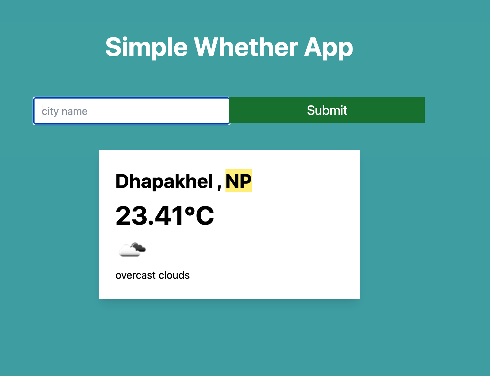

# 📌 React weather App 
- This is a React-based Weather Application that allows users to search for the current weather of any city in the world. The app uses the OpenWeatherMap API to fetch real-time weather data and displays it in a clean, responsive UI styled with TailwindCSS.


 
---

## 🚀 Features  
- 🌍 Search weather by city name
- 📡 Fetches real-time data from OpenWeatherMap API
- 📏 Displays temperature in metric units (°C)
- ⚡ Instant error handling for invalid city names 
- 🎨 Responsive UI with TailwindCSS
---

## 🛠️ Tech Stack  
- **Frontend:** React, TailwindCSS  
- **Other Tools:** WeatherOrg API  

---

## 📂 Project Structure  
```bash
project-root/
│── src/         # Source code  
│── public/      # Static files  
│── docs/        # Documentation  
│── tests/       # Unit & integration tests  
│── package.json # Dependencies & scripts  


## Installation & Setup

# 1. Clone the repository
git clone hhttps://github.com/Hemkant04/react-weather-app.git

# 2. Navigate into the project directory
cd react-weather-app

# 3. Install dependencies
npm install  # or yarn install

# 4. Start development server
npm run start
